# Atari Joystick Adapter
A bluetooth adapter for the Atari CX-40 joysticks

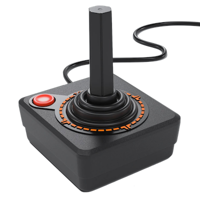

## Finished Product

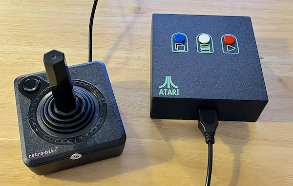

## Design Objectives
You might ask why I would build such a project. With the proliferation of existing gamepads, retro tech, and alternatives, what is it about this that makes it unique?

Fair question. To begin, let's roll back the clock. I used to have all the old systems, and when I wanted to play any of the retro machines, I would simply toss in the cartrtidge and play away, just like when I was a kid.

I've since sold my collection of retro game machines and recently got into emulation. Emulation affords me the opportunity to still play the old school games yet be able to do so on a single, modern appliance. 

This is great, except for one thing; The joysticks.

I miss playing games as they were intended. It just isn't the same thing playing Space Invaders on the Atari 2600 with the classic joystick as it is playing it on an emulator with a modern XBox controller.  Yes, it works fine, but the experience is not the same.

The Atari Joystick Adapter was born. *I wanted a way to use my classic joysticks the way the games were designed for while playing emulation.*
## Design Goals
**Classic Joysticks**

I wanted to be able to use my existing class joysticks without modification.

**Wireless**

The adapter needed to be wireless, so I can sit back on my couch and play games without being tethered to an applicance.

**Emulator Navigation**

I needed ther ability to navigater, and control the emulator with the classic joystick such that I could select, launch and plahy games without the use of another controller, remote, or keyboard.

**Additional Game System Buttons**

I needed the ability to mimic the buttons on the original Atari to begin playing games - Start for example.

**Battery Operated**

To be truly wireless, I needed to make this a battery operated device, and be able to charge the device simply by plugging in a USB-C cable such as is with modern rechargable devices.

**Professional**

Yeah yeah I know, this is a one off device but I want it to look professional, with a custom PCB, and a good looking multicolour 3D printed enclosure.

## The PCB

I designed the circuit using KiCad. I designed most of the symbols, and footprints, sans the simple capacitor, resistor, and connectors. The schematics and the KiCad project files can be found here: [Atari Joystick Adapter KiCad Project](kicad/)

Schematic:

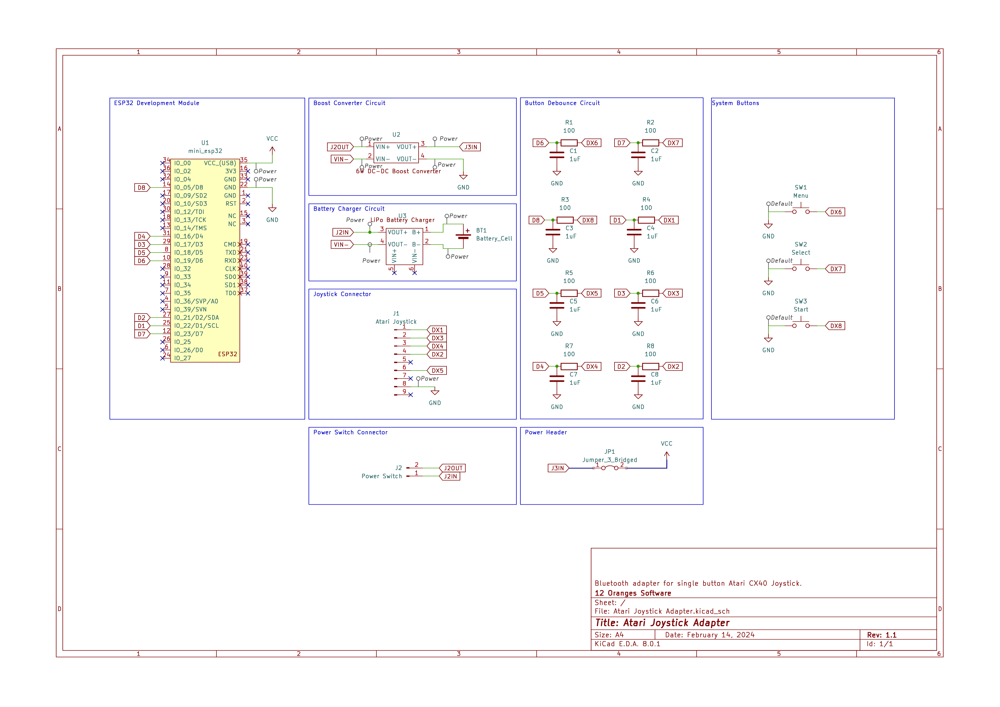

Here is a 3d Render (v1.1):

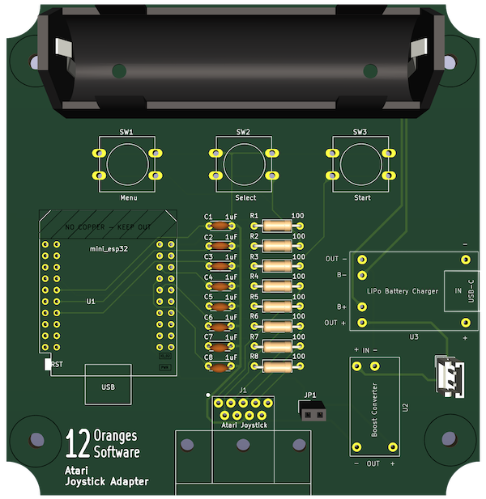

Here is a picture of the populated board (v1.0)

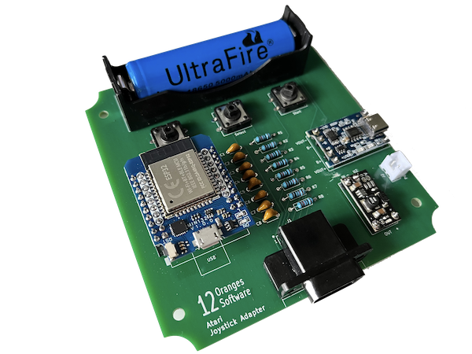

I send the gerber files to PCBWay to be built, and received 10 boards in about a week.

## Interfacing the Atari Joystick

Tha Atari joystick uses a simple mechanism to manage the four direction buttons and the fire button.  Each button is assigned to a pin on the connector, and when pressed brings the pin low, as is seen from the ground, or common pin on the connector, pin eight(8). This makes it quite easy to connect to the ESP32, all I needed was simple debounce circuits and can otherwise go striaght into the digital GPIO pins.

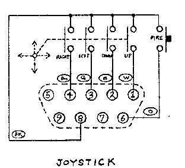

## The Atari Connector

I recall back in the seventies and eighties we used to use standard DB9 serial connectors when we were making Atari style joysticks or interfacing to them. While these don't quite fit perfectly, they do work well. For this project I wanted to finally make use of real Atari joystick connectors, so I found a source for them in San Jose, Best Electronics, and bough 20 of them.

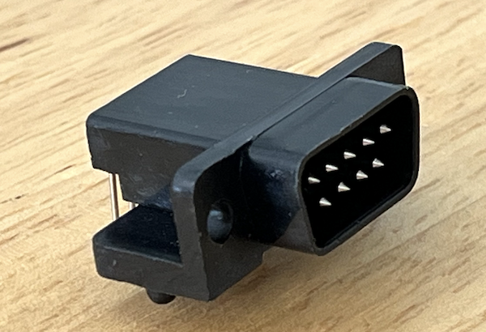

I've also modelled the Atari joystick connector in CAD.  Mostly just to hel pfacilitate designing theenclosure for fitmen, however I also added it to the KiCad footprint so you could also render the 3d model of the PCB with it as well.

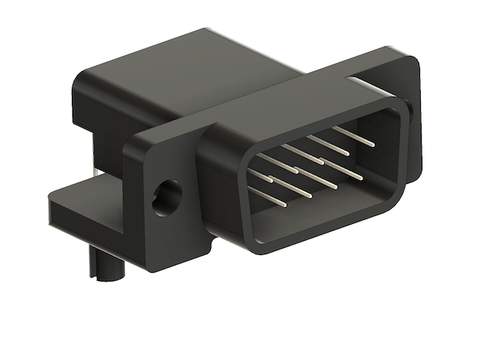

You can download the model here: [Atari Joystick Connector Model](models/atarijoystickmodel.step)

## ESP32

I ended up using the ESP32 Mini WROOM-32 by KeeYees.  I really like the mini board configuration, as I have used several of the similar D1Minis ESP8266's in the past.

The ESP32 dev board was the obvious choise for this project as it has the bluetooth connectivity I need and sufficient GPIO pins.

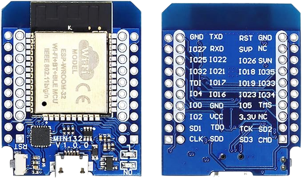

I used this ESP32 from Amazon: [ESP32 Mini Wroom-32](https://www.amazon.ca/gp/product/B08TBQRMY4)


## Battery and Battery Charging

One of my design goals was to use a rechargebale battery and circuit.  I had a bunch of 18650 batteries around for other projects, so that weemed like it would be a good fit for this project.  I would have to settle on a charging sircuit, and I could obtain a TC4056 Lithium Battery Charger Module Board from Amazon for quite cheap.  This would more than suffice for what I needed.  The ESP32 uses a 5V input, so I needed to deal with this, as the 18650 has a 3.7v output, which does diminish during it's charge/release cycle.  A simple DC-DC 6W Mini Step-Up Boost Converter would do the trick, and boost me up to 5V, regardless of the diminishing voltage. Perfect - Both these parts are cheap and easily available.

At this point all I had to do was throw a switch into the power curcuit and that should solve my power requirements. Done.

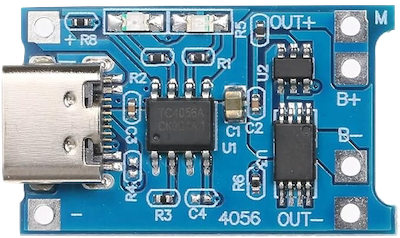

I purchased this [Battery Charger](https://www.amazon.ca/gp/product/B0B48VWHTD) from Amazon

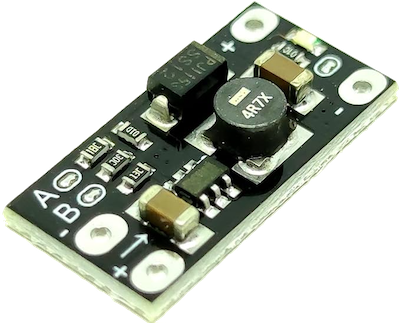

I purchased this [Boost Converter](https://www.amazon.ca/gp/product/B09TZSGHYK) from Amazon

## Enclosure

I designed the enclosure in Autodesks Fusion 360. I think it worked out quite well.  The enclosure consists of the main(top) piece, and the cover (bottom) as well as three switch extensions so you can use the three switches placed in the PCB such that they would extend the proper amount up and out of the top case.

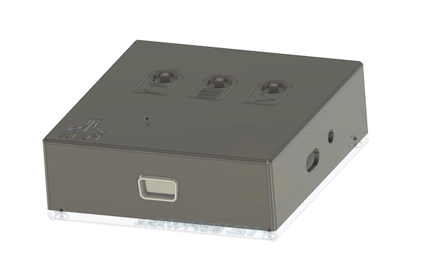

The enclosure CAD files can be found here: [Atari Joystick Adapter CAD Files](models)

The Bambu Studio .3mf file for the enclosure can be found here: [Atari Joystick Adapter Bambu Studio 3mf Porject File](bambustudio/Atari%20Joystick%20Adapter%20Case.3mf)

## The Code

I built the code for this project in C++ using Visual Studio Code and PlatformIO, with the Arduino Framework.  I make use the GamepadBLE library by lemmingDEV, found here: [ESP-32-BLE-Gamepad](https://github.com/lemmingDev/ESP32-BLE-Gamepad)

I use a number of classes to manage the program.  The main class is the Button class.  The Button class encapsulates everything needed to support using buttons on your retro joysticks. It will store the current button state, whether the state has changed, which ESP32 GPIO pin the button is assigned to, and it handles the hardware interupt callback for that button.  Each button manages it's own interup handler to encapsulate the interupt logic. This class is used for the joystick, or d-pad (hat) direction buttons.

The second Class is the FireButton class, extending the Button class.  This adds in the addition of a button identifier, used for gamepad buttons, such as the fire button.

The interupt service routines, in the button objects simply set the updated state, and flag the button as having changed state.

Managing the interupt handler in each object is a handy way to control state. Most solutions I have seen out on Youtube have some sort of global variables storing the state for all the buttons.  I like the ability to do this atomically, it keeps things clean.

Here is the Button class iniatializer funtion, setting the ISR for the class instance.
```
void Button::init() {
  // Set the pin to input and use a pullup resistor
  pinMode(pin, INPUT_PULLUP);

  // Set the current state of the pin
  this->state = LOW;

  // Let's attach the interupt handler
  std::function<void(void)> stdFunct {std::bind(&Button::instanceIsr, this)};
  attachInterrupt(digitalPinToInterrupt(this->pin), stdFunct, CHANGE);
}
```

The main loop of the application simply iterates over the button instances, checking if they have changed state.  If they have, then the new state is sent via the bluetooth gamepad.

The project code and all source files are included for you.

This project was built to accommodate the four joystick direction buttons, the single joystick fire button, as well as three additional buttons to support game system and emulator navigation and control.

The joystick direciton buttons are mapped to the four hat buttons in the gamepad emulation.  The possible states are:

```
  LEFT_UP:8     UP:1          UP_RIGHT:2 
  ⎡    ▲    ⎤   ⎡    ▲    ⎤   ⎡    ▲    ⎤
  ⎢    0    ⎟   ⎢    0    ⎟   ⎢    0    ⎟
  ⎢◀︎ 0   1 ▷⎟   ⎢◁ 1   1 ▷⎟   ⎢◁ 1   0 ▶︎⎟
  ⎢    1    ⎟   ⎢    1    ⎟   ⎢    1    ⎟ 
  ⎣    ▽    ⎦   ⎣    ▽    ⎦   ⎣    ▽    ⎦ 
  
  LEFT:7        CENTERED:0    RIGHT:3
  ⎡    △    ⎤   ⎡    △    ⎤   ⎡    △    ⎤
  ⎢    1    ⎟   ⎢    1    ⎟   ⎢    1    ⎟
  ⎢◀︎ 0   1 ▷⎟   ⎢◁ 1   1 ▷⎟   ⎢◁ 1   0 ▶︎⎟
  ⎢    1    ⎟   ⎢    1    ⎟   ⎢    1    ⎟
  ⎣    ▽    ⎦   ⎣    ▽    ⎦   ⎣    ▽    ⎦
  
  DOWN_LEFT:6   DOWN:5        DOWN_RIGHT:4
  ⎡    △    ⎤   ⎡    △    ⎤   ⎡    △    ⎤
  ⎢    1    ⎟   ⎢    1    ⎟   ⎢    1    ⎟ 
  ⎢◀︎ 0   1 ▷⎟   ⎢◁ 1   1 ▷⎟   ⎢◁ 1   0 ▶︎⎟
  ⎢    0    ⎟   ⎢    0    ⎟   ⎢    0    ⎟
  ⎣    ▼    ⎦   ⎣    ▼    ⎦   ⎣    ▼    ⎦
```
Each state is mapped to an integer value, from `0..8` and it is this integer value sent to the gamepad controller to register the d-pad presses in the emulator.

The four buttons are buttons `1..4`, and are typically registered, depending on the system you pair with, as buttons a, b, x, y on the gamepad controller in the emulator.

From here, you can assign each of these four buttons to whatever makes sense for you.  I used:
```
[a], [b], [select], [start]
```

## Emulator

I use Retroarch, and it was a little tricky getting the proper button assignments configured so I could navigate the Retroarch menu, launch the game in the emulator, and then start the game, and play the game all with only using the Atari joystick and the buttons on the adapter.

Once configured, it works incredibly well.

## Did I achieve my Goals?

Yes! I beleive so. Let's have a look:
- [x]  Classic Joysticks
- [x]  Wireless
- [x]  Emulator Navigation
- [x]  Additional Game System Buttons
- [x]  Battery Operated
- [x]  Professional

## Observations

1. Latency.  The latency is either incredible, or I am blind to it because I put so much effort into making this. In any event, gameplay is amazing, and very responsive.  I am very happy witht he latency given the bluetooth connectivity, and emulation.

2. I actually use this.  Unlike most of my projects which are super fun to build, they usually end up on a shelf, or in a drawer, and I tend to forget about them. THis project is different.  I actually is it, and is a lot of fun to play the games wit hthe classic controllers.

## What I Would do Different Next Time

1. Test Points. I would (and have in the v2 board) include test points to troubleshoot the circuit. This just makes things much easier to measure voltages and test your circuits.

2. Power Jumper. Ok, so I have to admint I placed all the parts, soldered everything in, and powered it on.  Of course, I forgot to configure the voltage booster from the default 12v to my required 5v, and I fried my brand new ESP32. 
 I've since added a two pin jumper that needs to be in place for the power to get to the ESP32, this way I can power the board up and test the circuit power without destroying the ESP.

3. My first prototype had the ESP32 soldered directly to the board, and while offers a nice finished product, see point 2 above, and I needed to remove it, so prototype two I put headers in and as you can see from the picture, the ESP32 is now removable, if ever needed.

4. While the 18650 works well, I might source a small flat pack litium ion battery. The package is much smaller and will have plenty of power for what I need.  Would also remove the need for the battery holder I had to source.

## Next Steps

1. Driving Controller. I would like to support the Atari driving controller used for games like Indy 500.

2. Paddle Controllers. I would also like to suppor the Atari Paddle controllers used for games like Super Breakout or Warlords.

3. Sega or Nintendo Controllers. Might be nice to extend this to use the controllers using shift registers or other multiplexers. Modern versions of these controllers can be purchased, so incertain about this.

4. Two Player support. At the moment, this is a device for a single Atari joystick. Perhaps I could extend this to support two joysticks for two player games without requiring two devices.

## Contact Me!

If you would like to discuss the project or have an idea, or question please reach out.  I can be reached at:

`ryan.fransen[the symbol for at]me.com`